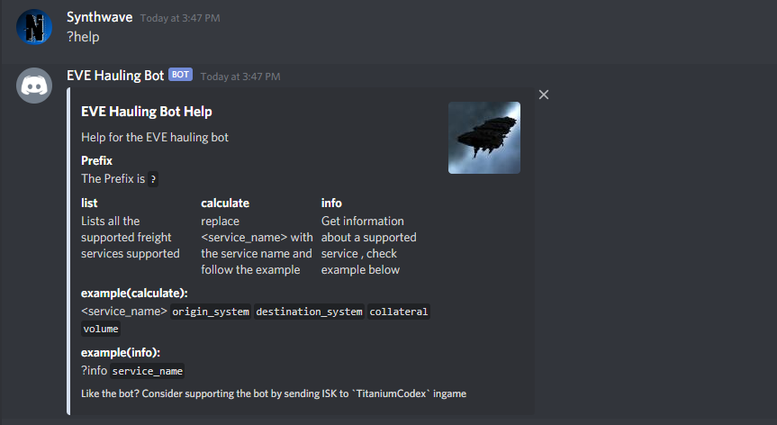
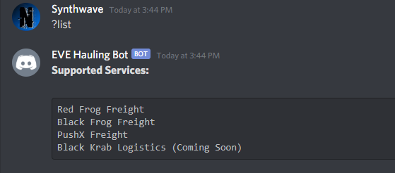
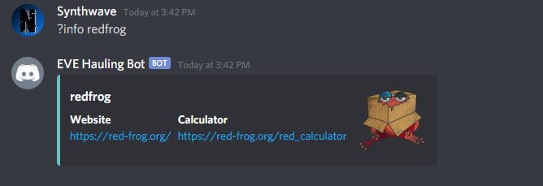
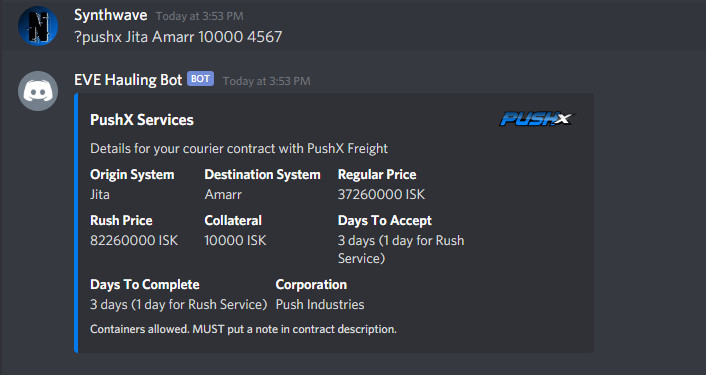

# EVE Hauling Bot

### A discord bot to calculate freight rates multiple freight services in [EVE Online](https://eveonline.com) right from your discord server.
 

# [Bot Command Cheatsheet](https://github.com/krishaayjois21/eve-hauling-discord/blob/master/docs/cheatsheet.md)
## All the commands you need to use the bot
 

## Prefix: `?`
## Bot Help:  `?help`

## Supported Services: `?list`

## Service Information: `?info <service_name>`
- ## Example: `?info redfrog`

## Get a Quote: `?<service_name> <origin> <destination> <collateral> <volume>`
- ## Example: `?pushx Jita Amarr 10000 4567`

## Report Bugs:
### If you encounter any issues (do any one of the following):
- Make an issue on this github repository

## Donate:
- If you like this bot please consider donating ISK to `TitaniumCodex` ingame.

## Coming Soon:
- Price comparison between the two
- Website for Bot

### Copyright ###
EVE Online and the EVE logo are the registered trademarks of CCP hf. All rights are reserved worldwide. All other trademarks are the property of their respective owners. EVE Online, the EVE logo, EVE and all associated logos and designs are the intellectual property of CCP hf. All artwork, screenshots, characters, vehicles, storylines, world facts or other recognizable features of the intellectual property relating to these trademarks are likewise the intellectual property of CCP hf.
